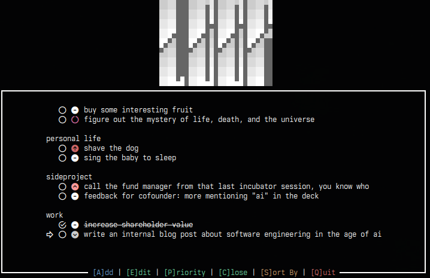

<div align="center">
  <br><br>
</div>

> A simple todo-list TUI, loosely based on [GTD](https://en.wikipedia.org/wiki/Getting_Things_Done).
> The name is short for **l**ist **o**f **o**pen **p**oints.

`loop` is keyboard-driven and aims to be as simple as possible to use. It is my latest attempt to
digitalize the list I've kept in paper on my desk for as long as I can remember. It is not the first
such attempt; I've successfully failed to consistently use:

- [Todoist](https://www.todoist.com/), although that one is great and if you're into cross-platform
  GUI stuff, give it a try.
- [Obsidian](https://obsidian.md/), which I still use for electronic note taking an organizing in
  general, just not for my LOOP.
- a simple [todo.txt](http://todotxt.org/), for which I'm just barely not boomer enough (which is
  what I like to tell myself about a number of things).

So `loop` is me disliking all terminal based apps I've found and writing my own, with the rationale
that my paper list, while it has largely served me well, has also a few clear shortcomings, and
perhaps since I already spend a good portion of my life staring at a terminal, perhaps this time is
the charm.

**Built with [ratatui](https://ratatui.rs/).**


## Features

- [x] **Fast capture** - press `a`, type a task, hit `Enter`.
- [x] **Priorities** - every task carries a priority, symboled and color coded.
- [x] **Sort by...** - cycle between sorting by context, priority, both, ...
- [x] **Local, plain-text storage** - all stored in JSON on disk.
- [ ] **Due dates** - tasks have a due date, and you can sort by due date.
- [ ] **Recurrence** - tasks can repeat weekly, monthly, quarterly, or yearly, with N days offset.
- [ ] **Sync across laptops** - keep it simple; perhaps device2device over SSH?

### This is my Zero Claude Project

I like LLMs, but I believe everyone should have a zero Claude project, in which LLMs are not used
(or at least not used for generating more than snippets that contribute to learning). Read more
about this [in my blog](https://cdbrkfxrpt.ch/blog/zero-claude-project/).


## Install

### With Cargo (what I do)

```sh
cargo install loop-tui
```

### With Nix

The repo ships a flake, so you can run it without cloning:

```sh
nix run github:cdbrkfxrpt/loop-tui
```

It's not in nixpkgs. I'm not convinced it should be. Let me know if you disagree.


## Usage

Should be self-explanatory once you start it. Use either up/down or j/k to navigate up and down.


## Data & configuration

`loop` uses your platform's conventional directories (via
[directories](https://crates.io/crates/directories)) under the `org.cdbrkfxrpt.loop` namespace:

- **Config** (`config.json`) - eg, Linux: `~/.config/loop/`
- **Data** (`data.json`) - eg, Linux: `~/.local/share/loop/`

See the [directories docs](https://docs.rs/directories/latest/directories/struct.ProjectDirs.html)
for the paths on macOS and Windows.


## License

MIT © Florian Eich

```
                                    ░░   █ ░░▀▒ █ ░░▀▒   ░░▀▒
                                  ░░▒▒   ░░▒▒ ▓ ░░▒▒ ▓ ░░▒▒ ▓
                                  ▒▒▓▓   ▒▒▓▓ ▀ ▒▒▓▓ ▀ ▒▒▓▓ ▀
                                  ▓▓█▀   ▓▓█▀ █ ▓▓█▀ █ ▓▓█▀▄█
                                  █▀▀    █▀▀  ░ █▀▀  ░ █▀▀
                                  ▀ ░░   ▀ ░░ ▒ ▀ ░░ ▒ ▀ ░░
                                  ░░▒▒   ░░▒▒ ▓ ░░▒▒ ▓ ░░▒▒
                                  ▒▒▓▓   ▒▒▓▓ █ ▒▒▓▓ █ ▒▒▓▓
                                  ▓▓██▄█ ▓▓██▄█ ▓▓██▄█ ▓▓██
```
